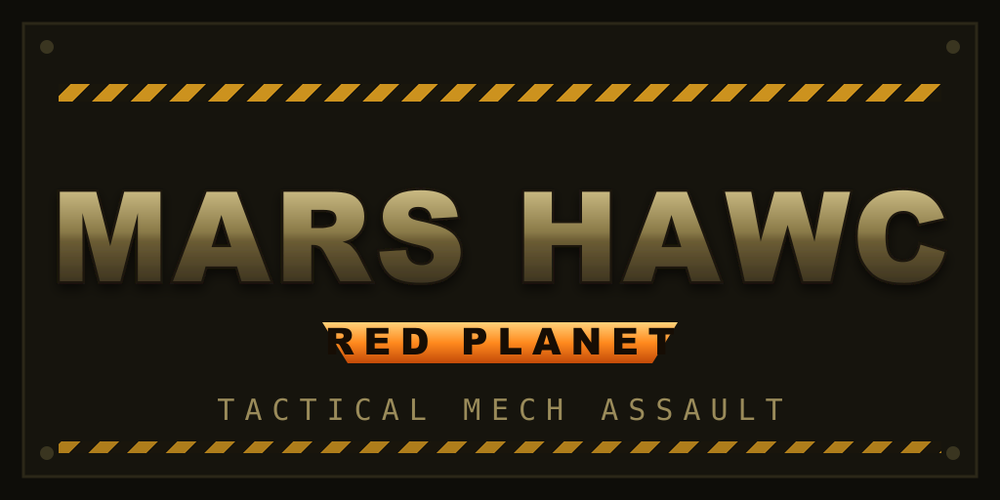

# MARS HAWC — Tactical Mech Assault

Pilot a walking combat mech (a **HAWC**) on the real Martian surface and hold
contested territory against rival factions. Built in **Godot 4.6**, on terrain
carved from genuine NASA HiRISE elevation data of Candor Chasma.

> An independent, open-source game. Not affiliated with, or endorsed by, any
> prior work of a similar name.



---

## Play it

You need **[Godot 4.6+](https://godotengine.org/download)** (standard build).

```bash
git clone https://github.com/sinhaankur/gnome-hd-mars.git
cd gnome-hd-mars
# Some large models are stored with Git LFS — make sure it's installed:
git lfs install && git lfs pull
# Open the project:
godot --path godot        # or open godot/project.godot in the Godot editor and hit Play
```

The game boots to the main menu → pick **Start Campaign** or **Select Mission**.

### Controls

| Action | Key |
| --- | --- |
| Move | `W` `A` `S` `D` |
| Look / aim | Mouse |
| Jump / boost | `Space` |
| Fire | Left mouse / `Fire` |
| Secondary | Right mouse |
| Interact — board / exit a HAWC | `E` |
| GASHR — eject an enemy pilot | `Q` |
| Camera mode | toggle key |

**The core loop:** exit your HAWC on foot, sprint to an enemy HAWC, hit **GASHR**
to eject its pilot, then press **E** to steal it. Fragile on foot, unstoppable
in a fresh mech.

---

## What's in it

- A **vertical slice → 8-mission campaign** across Mars biomes (border desert,
  ice fields, volcanic wastes, a research caldera).
- Three interacting engines: **Environment** (Mars day/night cycle drives all
  lighting), **HAWC** (the player mech), and **Enemy** (role-driven AI —
  rush / snipe / anchor / flank, with strafe & retreat behaviour).
- Wave-defense objectives, possession/steal mechanics, procedural audio, combat
  FX, an orbital-arrival intro, and a strategic **planet globe** territory layer.
- Real Mars terrain (HiRISE DTM, ~1 m/px) instead of low-res global relief.

---

## License

Original code, design, story, and tools are **© 2026 Ankur Sinha**, released
under the **MIT License** (see [LICENSE](LICENSE)).

Third-party assets (the CC-BY mechs, Mars globe texture, NASA terrain data) keep
their own licenses — **keep those attributions** if you redistribute. See
[CREDITS.md](CREDITS.md). The original 1997 game files are **not** part of this
repository.

Mech models "Bot Mecha Warrior" by **Oscar Creativo** (CC-BY 4.0). Mars globe
texture by **Solar System Scope** (CC-BY 4.0). Terrain from **NASA HiRISE**.

---

## Comments & Feedback

This is an in-progress project shared so others can **explore and play**.
Feedback of every kind is welcome — bugs, balance, feel, visuals, ideas.

- **Found a bug or have a suggestion?**
  [Open an issue](https://github.com/sinhaankur/gnome-hd-mars/issues) — include
  your OS, Godot version, and what happened.
- **Want to discuss or share a clip?** Use
  [Discussions](https://github.com/sinhaankur/gnome-hd-mars/discussions).
- **Playing it?** A ⭐ on the repo helps, and telling me what felt good vs. what
  felt off is the single most useful thing you can leave.

Known rough edges (contributions welcome): hero-mech material/brightness pass,
mission variety, and player-kit depth are still being worked on.
